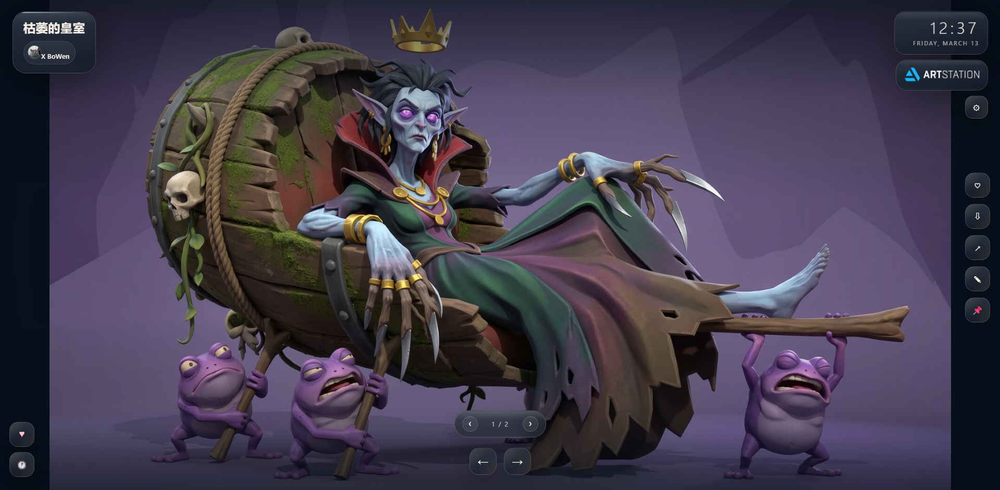
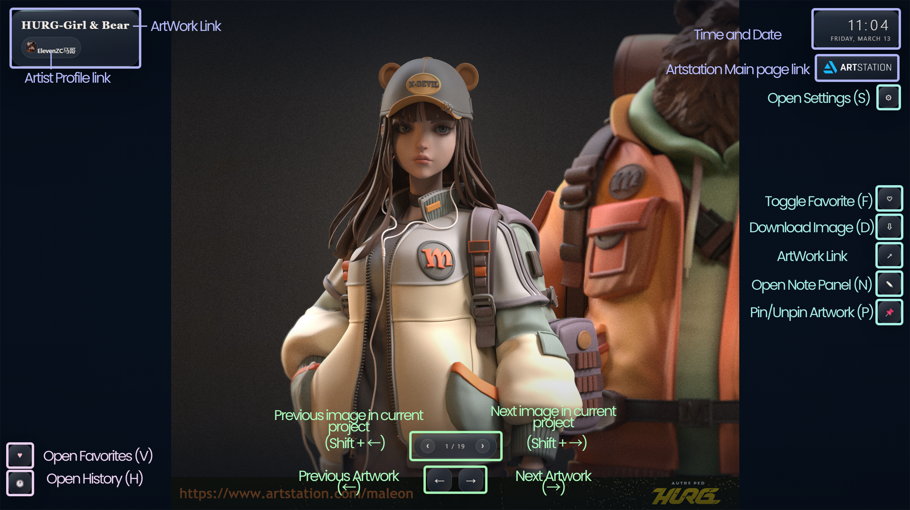
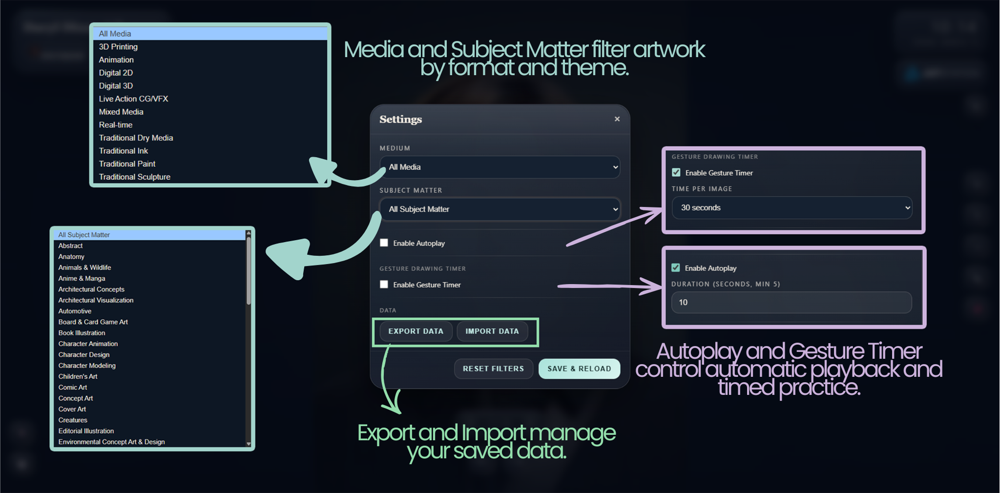
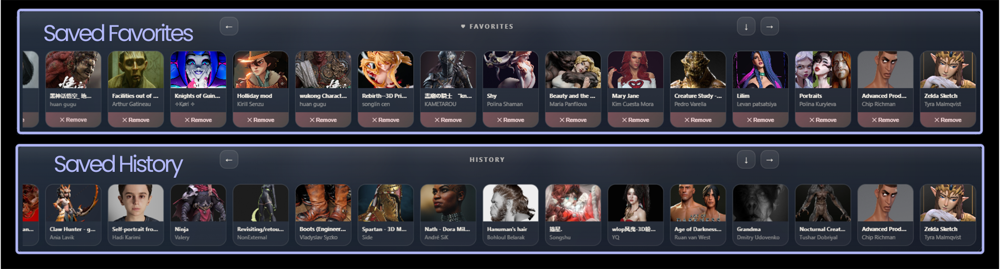
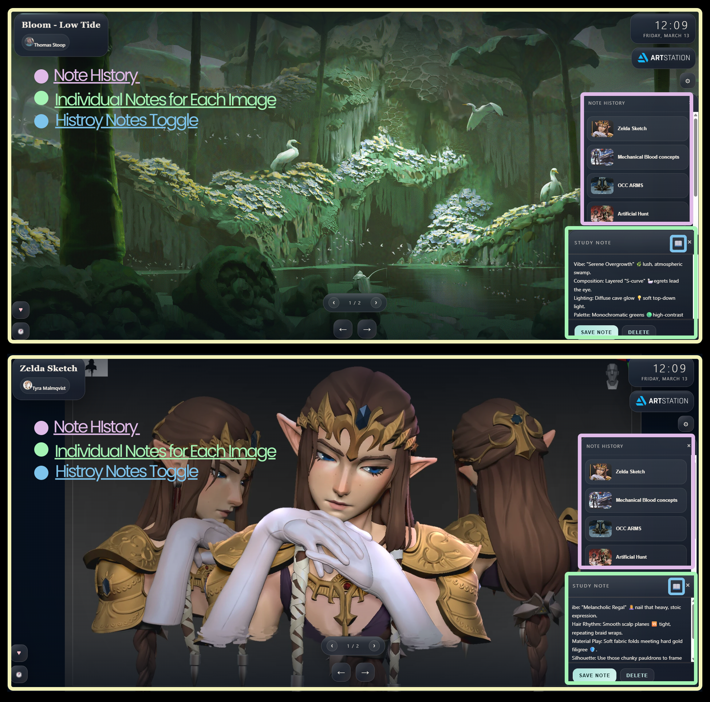

# 🚉 RefStation

> A cinematic new tab for visual study, quiet inspiration, and reference-driven flow.



**RefStation** is a Chrome Extension (Manifest V3) that replaces your new tab with curated ArtStation artwork for inspiration, practice, and focus.

It blends a full-screen art viewing experience with practical artist tools like favorites, history, pinned references, study notes, autoplay, gesture timing, offline fallback, and backup import/export.

It is built for people who want less clutter and more focus:

- one strong image at a time
- fast access to saved favorites and history
- personal study notes attached to artworks
- immersive presentation instead of dashboard noise

---

## ✨ Highlights

- 🖼️ **Immersive art-first new tab**
- 🎯 **Built for artists and learners**
- ❤️ **Favorites + History + Pin workflow**
- 📝 **Per-artwork study notes**
- 🗂️ **Note history for revisiting meaningful studies**
- ⏱️ **Autoplay and gesture drawing timer**
- 📴 **Offline fallback support**
- 💾 **Export/Import your full local data**
- ⌨️ **Keyboard shortcut-driven UX**

---

## At A Glance

RefStation turns the browser new tab page into a full-screen ArtStation reference viewer with local memory.

Every time a new tab opens, RefStation can:

- fetch a random ArtStation project
- show its main image in a clean full-screen layout
- let you browse multi-image projects
- save the artwork in history
- let you favorite it
- let you pin it
- let you add a note
- let you revisit artworks that already have notes
- continue working even when offline through bundled fallback images

It is simple on the surface, but thoughtfully layered underneath.

---

## The Feeling

RefStation is designed around a very specific mood:

- calm
- focused
- immersive
- visually rich without being noisy

The app is meant to feel like a private visual station, not a productivity dashboard.

You open a tab.  
You land inside an artwork.  
You keep what matters.  
You move on only when you are ready.

---

## Visual Tour

### Main Experience

The main page is designed to feel calm, spacious, and reference-first.



### Settings And Control

Settings stay compact, readable, and focused on the workflow instead of overwhelming the user.



### History And Favorites

History and favorites work like a visual memory strip, letting you revisit references quickly without leaving the artwork-first experience.



### Notes And Note History

The note system is built for real study use: quick note capture, note recall, and visual jumping between artworks that already matter to you.



---

## 🧠 Feature Tour

## 1. Random ArtStation Viewer

RefStation fetches a random ArtStation project and normalizes it into an internal project shape so the UI can treat live and offline images consistently.

What gets shown:

- title
- artist name
- artist avatar
- project page link
- artwork image
- multi-image count when available

## 2. Full-Screen Artwork Experience

The main viewer is designed to keep the artwork as the center of attention.

The surrounding interface includes:

- top-left artwork metadata card
- top-right clock and ArtStation badge
- right-side action rail
- bottom navigation
- subtle ambient background and overlay layers

The interface fades back when idle so the artwork stays visually dominant.

## 3. Smart Filtering

RefStation supports filtering by ArtStation metadata such as:

- **Medium**
- **Subject Matter**

Filter options are loaded from ArtStation endpoints and can be adjusted in settings.

## 4. Favorites

Any artwork can be saved into favorites.

Favorites can then be reopened later through the favorites drawer.

Favorites are stored locally and survive browser restarts.

## 5. History

Viewed artworks are stored in local history.

The history drawer lets you:

- revisit past artworks
- scroll through them horizontally
- drag the row with the mouse
- jump back into a chosen artwork

## 6. Study Notes

Each artwork can have its own note.

This is useful for:

- composition observations
- anatomy notes
- lighting reminders
- color ideas
- study goals

Each note is keyed to the artwork `hash_id`.

## 7. Note History

The note panel also includes a note history workflow.

It shows only artworks that currently have saved notes.

That means you can treat it like a study memory lane:

- click a noted artwork
- switch the main image
- keep the note workflow going
- revisit only meaningful saved studies

## 8. Multi-Image Project Support

Some ArtStation projects contain several images.

When that happens, RefStation shows:

- an image counter
- previous / next image buttons
- per-image navigation without leaving the project

## 9. Pinning

You can pin the current artwork so it stays fixed instead of being replaced by the next random fetch.

This is useful for:

- long study sessions
- keeping one reference open while drawing
- revisiting a favorite visual mood

## 10. Autoplay

RefStation can automatically rotate artworks after a chosen duration.

This includes:

- a toggle
- a duration setting
- a visual ring progress indicator

## 11. Gesture Drawing Timer

The extension can also act as a light gesture practice tool.

When enabled, it cycles artworks after a timed interval.

Common durations include:

- 30s
- 1m
- 2m
- 5m
- 10m

## 12. Offline Fallback

If ArtStation cannot be reached, RefStation falls back to bundled offline references stored inside the project.

So even without network access, the tab page remains useful.

## 13. Import / Export

You can export and restore your local state.

This includes:

- favorites
- notes
- history
- settings
- pinned artwork

---

## Interface Map

### Top Left

- artwork title
- artist identity chip

### Top Right

- clock
- date
- ArtStation badge
- settings button
- pinned indicator

### Right Action Rail

- favorite
- download
- open in ArtStation
- note
- pin

### Bottom Center

- previous / next artwork navigation
- multi-image project controls when applicable

### Bottom Left

- favorites drawer button
- history drawer button

### Note Layer

- study note panel
- note history panel

---

## 📁 Project Structure

```text
RefStation/
├── artstation.html
├── manifest.json
├── assets/
│   ├── css/
│   │   └── app.css
│   └── js/
│       ├── app.js
│       ├── api.js
│       ├── state.js
│       ├── ui.js
│       └── background.js
└── offline/
    └── offline.json

```

## 👤 Author

**tojicb-fushiguro**

---

## 🙏 Inspiration

RefStation is inspired by the broader idea of an art-first new tab experience, especially the kind of visual discovery flow popularized by tools like the ArtStation Discover extension.

That said, **RefStation has evolved into its own project** with a different workflow focus, codebase, UI direction, and feature set. This repository’s implementation is original and built around a more immersive, study-oriented experience with features like:

- favorites, history, and pinning
- per-artwork study notes
- note history
- autoplay and gesture drawing timers
- local import/export backups
- keyboard-first navigation
- a more cinematic full-screen presentation
- smoother UI/UX

---

## 📜 License & Legal

This project is currently **unlicensed** and shared for **personal, non-commercial use**.

**Inspiration & Origin:**  
RefStation began as a personal reimagining of the “artwork in a new tab” concept, but has since grown into a more specialized reference and study tool. While the general idea of browsing artwork from a browser extension is not unique, the **implementation in this repository, interface design, workflow, and feature set** are original to this project.

This includes RefStation’s specific combination of:

- cinematic artwork presentation
- favorites and history workflows
- pinned references
- study note support
- note-history browsing
- gesture timing and autoplay tools
- offline fallback handling
- import/export of local data

**Notice to Rights Holders:**  
There is no intent to sell, market, or monetize this project. If you are a rights holder and believe something here raises a concern, please open an issue and it will be reviewed and addressed respectfully.

---

## 🙌 Credits

- **ArtStation:** for the incredible artist community and artwork ecosystem
- **Built by:** [tojicb-fushiguro](https://github.com)

---

## 🚉 RefStation Philosophy

**RefStation** = daily inspiration + focused study flow + better new tabs

---
